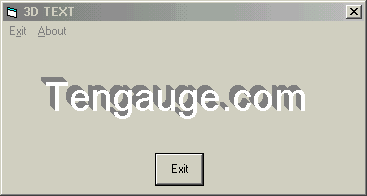



## Text, 3D

### Description

The most simplest way to make 3d text, just see what you can do with it, Just updated for you "The VB Lovers"
 
### More Info
 

             |
---                |---
**Submitted On**   |2001-08-05 16:25:14
**By**             |[PebbyCat](https://github.com/Planet-Source-Code/PSCIndex/blob/master/ByAuthor/pebbycat.md)
**Level**          |Beginner
**User Rating**    |4.3 (17 globes from 4 users)
**Compatibility**  |VB 5\.0, VB 6\.0
**Category**       |[Coding Standards](https://github.com/Planet-Source-Code/PSCIndex/blob/master/ByCategory/coding-standards__1-43.md)
**World**          |[Visual Basic](https://github.com/Planet-Source-Code/PSCIndex/blob/master/ByWorld/visual-basic.md)
**Archive File**   |[Text, 3D24116852001\.zip](https://github.com/Planet-Source-Code/pebbycat-text-3d__1-25699/archive/master.zip)

